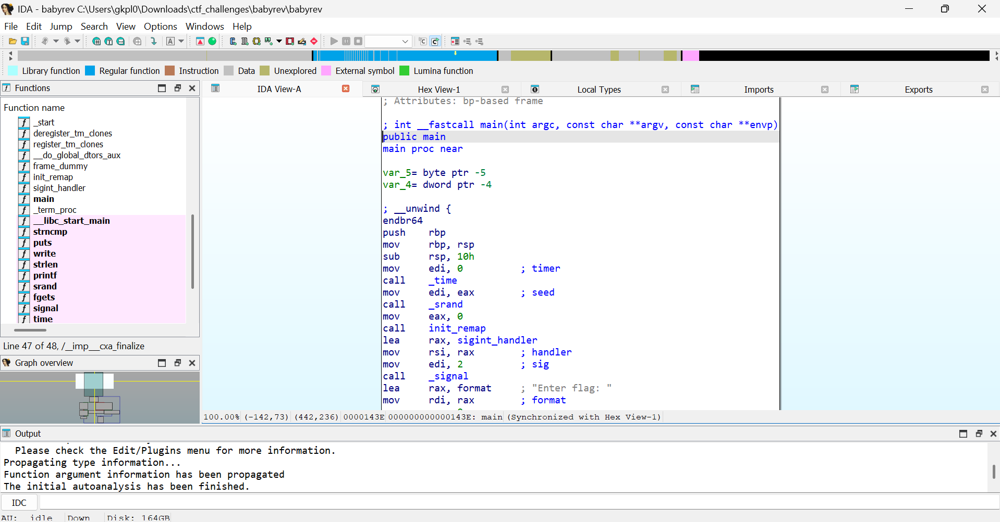

# Titre: BabyRev 


##  Aperçu du Challenge

- **Catégorie**: Reverse Engineering
- **Difficulté**: Easy
- **Flag**: `L3AK{you_are_not_gonna_guess_me}`
- **Points**: 50

##  Description du Challenge

Un challenge de Reverse Engineering  impliquant un binaire qui utilise une table de remapping pseudo-aléatoire pour transformer l'entrée utilisateur avant de la comparer avec une chaîne cible.

## Analyse Initiale

### Information sur le Fichier
```bash
┌──(kali㉿kali)-[/media/sf_Downloads/ctf_challenges/babyrev]
└─$ file babyrev
babyrev: ELF 64-bit LSB pie executable, x86-64, version 1 (SYSV), dynamically linked, interpreter /lib64/ld-linux-x86-64.so.2, BuildID[sha1]=d30e77a25a8571ad0c6f336287fe9ce74ea9bb7c, for GNU/Linux 3.2.0, not stripped

```
Un overview avec *IDA*, les fonctions sont à gauche, je retrouve une fonction *main* qui me fait rediriger vers une autre fonction  *init_remap* 



Après celà j'ai eu l'idée de decompiler l'executable pour voir le pseudo-code C des deux fontions, et voici le résultat obtenu avec IDA, 

et voici *main()*

```bash 

int __fastcall main(int argc, const char **argv, const char **envp)
{
  unsigned int v3; // eax
  __int64 v4; // rdi
  size_t v5; // rax
  char v7; // [rsp+Bh] [rbp-5h]
  int i; // [rsp+Ch] [rbp-4h]

  v3 = time(0);
  v4 = v3;
  srand(v3);
  init_remap(v4, argv);
  signal(2, sigint_handler);
  printf("Enter flag: ");
  fflush(_bss_start);
  fgets(input, 64, stdin);
  for ( i = 0; input[i]; ++i )
  {
    v7 = input[i];
    if ( v7 >= 0 )
      input[i] = remap[(unsigned __int8)v7];
  }
  v5 = strlen(flag);
  if ( !strncmp(input, flag, v5) )
    puts("Correct! Here is your prize.");
  else
    puts("Wrong flag. Try harder.");
  return 0;
}
```

*init_remap()*
```bash
__int64 init_remap()
{
  __int64 result; // rax
  int i; // [rsp+0h] [rbp-4h]

  for ( i = 0; i <= 127; ++i )
  {
    result = i;
    remap[i] = i;
  }
  qmemcpy(&byte_4121, "qwertyuiopasdfghjklzxcvbnm", 26);
  return result;
}
```
### Analyse Statique
Le binaire contient alors:
- Une fonction `main` qui gère la logique principale
- Une fonction `init_remap` qui crée une table de remapping
- Une comparaison avec un flag encodé : 
```bash
data:0000000000004010                 align 20h
.data:0000000000004020                 public flag
.data:0000000000004020 ; char flag[]
.data:0000000000004020 flag            db 'L3AK{ngx_qkt_fgz_ugffq_uxtll_dt}',0
.data:0000000000004020                                         ; DATA XREF: main+D8↑o
.data:0000000000004020                                         ; main+EA↑o
.data:0000000000004041                 align 20h
```
`L3AK{ngx_qkt_fgz_ugffq_uxtll_dt}`

### Flux du Code Principal
1. `time(0)` génère un timestamp
2. `srand(timestamp)` initialise le générateur de nombres aléatoires
3. `init_remap()` crée une table de remapping de 256 octets
4. L'entrée utilisateur est lue avec `fgets()`
5. Chaque caractère est transformé : `input[i] = remap[input[i]]`
6. L'entrée transformée est comparée avec la cible en utilisant `strncmp()`

## Ma Stratégie de Solution

Après avoir résolu le chall j'ai pensé tout de suite à d'autre méthodes, grace à un script que j'ai crée...

### Méthode 1 : Analyse Dynamique avec GDB (celle que j'ai utilisé)

L'idée clé est que nous devons **inverser le processus de remapping**. Au lieu de deviner le timestamp ou de patcher le binaire, nous extrayons la table de remapping directement de la mémoire.

###  Analyse Préliminaire

#### 1. Vérification du fichier
```bash
chmod +x babyrev
file babyrev
```

#### 2. Test d'exécution rapide
```bash
──(kali㉿kali)-[/media/sf_Downloads/ctf_challenges/babyrev]
└─$ ./babyrev
Enter flag: test
Wrong flag. Try harder.

```

###  Analyse Statique avec GDB

#### Étape 1: Désassemblage de la fonction main
```bash
┌──(kali㉿kali)-[/media/sf_Downloads/ctf_challenges/babyrev]
└─$ gdb ./babyrev
GNU gdb (Debian 16.3-1) 16.3
Copyright (C) 2024 Free Software Foundation, Inc.
License GPLv3+: GNU GPL version 3 or later <http://gnu.org/licenses/gpl.html>
This is free software: you are free to change and redistribute it.
There is NO WARRANTY, to the extent permitted by law.
Type "show copying" and "show warranty" for details.
This GDB was configured as "x86_64-linux-gnu".
Type "show configuration" for configuration details.
For bug reporting instructions, please see:
<https://www.gnu.org/software/gdb/bugs/>.
Find the GDB manual and other documentation resources online at:
    <http://www.gnu.org/software/gdb/documentation/>.

For help, type "help".
Type "apropos word" to search for commands related to "word"...
Reading symbols from ./babyrev...
(No debugging symbols found in ./babyrev)
(gdb) disas main
Dump of assembler code for function main:
   0x000000000000143e <+0>:	endbr64
   0x0000000000001442 <+4>:	push   %rbp
   0x0000000000001443 <+5>:	mov    %rsp,%rbp
   0x0000000000001446 <+8>:	sub    $0x10,%rsp
   0x000000000000144a <+12>:	mov    $0x0,%edi
   0x000000000000144f <+17>:	call   0x1170 <time@plt>
   0x0000000000001454 <+22>:	mov    %eax,%edi
   0x0000000000001456 <+24>:	call   0x1140 <srand@plt>
   0x000000000000145b <+29>:	mov    $0x0,%eax
   0x0000000000001460 <+34>:	call   0x1289 <init_remap>
   0x0000000000001465 <+39>:	lea    -0xfb(%rip),%rax        # 0x1371 <sigint_handler>
   0x000000000000146c <+46>:	mov    %rax,%rsi
   0x000000000000146f <+49>:	mov    $0x2,%edi
   0x0000000000001474 <+54>:	call   0x1160 <signal@plt>
   0x0000000000001479 <+59>:	lea    0xb97(%rip),%rax        # 0x2017
   0x0000000000001480 <+66>:	mov    %rax,%rdi
   0x0000000000001483 <+69>:	mov    $0x0,%eax
   0x0000000000001488 <+74>:	call   0x1130 <printf@plt>
   0x000000000000148d <+79>:	mov    0x2bcc(%rip),%rax        # 0x4060 <stdout@GLIBC_2.2.5>
   0x0000000000001494 <+86>:	mov    %rax,%rdi
   0x0000000000001497 <+89>:	call   0x1180 <fflush@plt>
   0x000000000000149c <+94>:	mov    0x2bcd(%rip),%rax        # 0x4070 <stdin@GLIBC_2.2.5>
   0x00000000000014a3 <+101>:	mov    %rax,%rdx
   0x00000000000014a6 <+104>:	mov    $0x40,%esi
   0x00000000000014ab <+109>:	lea    0x2bce(%rip),%rax        # 0x4080 <input>
   0x00000000000014b2 <+116>:	mov    %rax,%rdi
   0x00000000000014b5 <+119>:	call   0x1150 <fgets@plt>
   0x00000000000014ba <+124>:	movl   $0x0,-0x4(%rbp)
   0x00000000000014c1 <+131>:	jmp    0x1502 <main+196>
   0x00000000000014c3 <+133>:	mov    -0x4(%rbp),%eax
   0x00000000000014c6 <+136>:	cltq
   0x00000000000014c8 <+138>:	lea    0x2bb1(%rip),%rdx        # 0x4080 <input>
   0x00000000000014cf <+145>:	movzbl (%rax,%rdx,1),%eax
   0x00000000000014d3 <+149>:	mov    %al,-0x5(%rbp)
   0x00000000000014d6 <+152>:	movzbl -0x5(%rbp),%eax
   0x00000000000014da <+156>:	test   %al,%al
   0x00000000000014dc <+158>:	js     0x14fe <main+192>
   0x00000000000014de <+160>:	movzbl -0x5(%rbp),%eax
   0x00000000000014e2 <+164>:	cltq
   0x00000000000014e4 <+166>:	lea    0x2bd5(%rip),%rdx        # 0x40c0 <remap>
   0x00000000000014eb <+173>:	movzbl (%rax,%rdx,1),%edx
   0x00000000000014ef <+177>:	mov    -0x4(%rbp),%eax
   0x00000000000014f2 <+180>:	cltq
--Type <RET> for more, q to quit, c to continue without paging--
   0x00000000000014f4 <+182>:	lea    0x2b85(%rip),%rcx        # 0x4080 <input>
   0x00000000000014fb <+189>:	mov    %dl,(%rax,%rcx,1)
   0x00000000000014fe <+192>:	addl   $0x1,-0x4(%rbp)
   0x0000000000001502 <+196>:	mov    -0x4(%rbp),%eax
   0x0000000000001505 <+199>:	cltq
   0x0000000000001507 <+201>:	lea    0x2b72(%rip),%rdx        # 0x4080 <input>
   0x000000000000150e <+208>:	movzbl (%rax,%rdx,1),%eax
   0x0000000000001512 <+212>:	test   %al,%al
   0x0000000000001514 <+214>:	jne    0x14c3 <main+133>
   0x0000000000001516 <+216>:	lea    0x2b03(%rip),%rax        # 0x4020 <flag>
   0x000000000000151d <+223>:	mov    %rax,%rdi
   0x0000000000001520 <+226>:	call   0x1120 <strlen@plt>
   0x0000000000001525 <+231>:	mov    %rax,%rdx
   0x0000000000001528 <+234>:	lea    0x2af1(%rip),%rax        # 0x4020 <flag>
   0x000000000000152f <+241>:	mov    %rax,%rsi
   0x0000000000001532 <+244>:	lea    0x2b47(%rip),%rax        # 0x4080 <input>
   0x0000000000001539 <+251>:	mov    %rax,%rdi
   0x000000000000153c <+254>:	call   0x10f0 <strncmp@plt>
   0x0000000000001541 <+259>:	test   %eax,%eax
   0x0000000000001543 <+261>:	jne    0x1556 <main+280>
   0x0000000000001545 <+263>:	lea    0xad8(%rip),%rax        # 0x2024
   0x000000000000154c <+270>:	mov    %rax,%rdi
   0x000000000000154f <+273>:	call   0x1100 <puts@plt>
   0x0000000000001554 <+278>:	jmp    0x1565 <main+295>
   0x0000000000001556 <+280>:	lea    0xae4(%rip),%rax        # 0x2041
   0x000000000000155d <+287>:	mov    %rax,%rdi
   0x0000000000001560 <+290>:	call   0x1100 <puts@plt>
   0x0000000000001565 <+295>:	mov    $0x0,%eax
   0x000000000000156a <+300>:	leave
   0x000000000000156b <+301>:	ret
End of assembler dump.
(gdb) 

```


#### Points clés identifiés dans le désassemblage:
- `0x000000000000144f <+17>`: `call 0x1170 <time@plt>` - Génération du timestamp
- `0x0000000000001456 <+24>`: `call 0x1140 <srand@plt>` - Initialisation du générateur aléatoire
- `0x0000000000001460 <+34>`: `call 0x1289 <init_remap>` - Création de la table de remapping
- `0x00000000000014b5 <+119>`: `call 0x1150 <fgets@plt>` - Lecture de l'input utilisateur
- `0x000000000014eb <+173>`: Transformation des caractères avec la table remap
- `0x000000000000153c <+254>`: `call 0x10f0 <strncmp@plt>` - Comparaison avec le flag encodé

### Stratégie de Solution

#### Étape 2: Extraction de la table de remapping
```bash
#Démarrer GDB avec notre exe
gdb ./babyrev

#Plaçons now un point d'arrêt au main pour gérer ASLR
(gdb) break main
(gdb) run

#et ensuit j'ai pensé à un autre point d'arrêt après init_remap (main+39)
(gdb) break *main+39
(gdb) continue
```
Voic un p'tit résumé dans mon terminal
```bash

(gdb) break main
Breakpoint 1 at 0x1446
(gdb) run
Starting program: /media/sf_Downloads/ctf_challenges/babyrev/babyrev 
[Thread debugging using libthread_db enabled]
Using host libthread_db library "/lib/x86_64-linux-gnu/libthread_db.so.1".

Breakpoint 1, 0x0000555555555446 in main ()
(gdb) break *main+39
Breakpoint 2 at 0x555555555465
(gdb) continue
Continuing.

Breakpoint 2, 0x0000555555555465 in main ()
(gdb) 

```

#### Étape 3: Localisation de la table remap
```bash
# pour juste retrouver l'adresse réelle de la table remap car moi j'ai la flemme d'aller manuellement à la recherche de notre variable remap

# en faisant ceci: 

(gdb) info variables remap
All variables matching regular expression "remap":

Non-debugging symbols:
0x00005555555580c0  remap
(gdb) 

```
Super, nous avons l'adresse de remap directly...

#### Étape 4: Extraction des données
```bash
# Extraire la table de remapping complète (256 bytes) 
(gdb) dump binary memory remap_table.bin 0x00005555555580c0 0x00005555555581c0
(gdb) quit
A debugging session is active.

	Inferior 1 [process 11207] will be killed.

Quit anyway? (y or n) y
                                                                                                                     
┌──(kali㉿kali)-[/media/sf_Downloads/ctf_challenges/babyrev]
└─$ 


```


#### Étape 5: Vérification du fichier extrait
```bash
ls -la remap_table.bin
──(kali㉿kali)-[/media/sf_Downloads/ctf_challenges/babyrev]
└─$ ls -la remap_table.bin
-rwxrwx--- 1 root vboxsf 256 Jul 12 12:13 remap_table.bin
                                                                                                                     
┌──(kali㉿kali)-[/media/sf_Downloads/ctf_challenges/babyrev]
└─$ 


# Vérifier quelques octets (optionel mais amusons nous tout de meme)
┌──(kali㉿kali)-[/media/sf_Downloads/ctf_challenges/babyrev]
└─$ xxd remap_table.bin | head -5
00000000: 0001 0203 0405 0607 0809 0a0b 0c0d 0e0f  ................
00000010: 1011 1213 1415 1617 1819 1a1b 1c1d 1e1f  ................
00000020: 2021 2223 2425 2627 2829 2a2b 2c2d 2e2f   !"#$%&'()*+,-./
00000030: 3031 3233 3435 3637 3839 3a3b 3c3d 3e3f  0123456789:;<=>?
00000040: 4041 4243 4445 4647 4849 4a4b 4c4d 4e4f  @ABCDEFGHIJKLMNO

```

###  Décodage avec Python ( mon script est déjà à votre discposition dans le repertoire du dépot, j'y ai développé trois méthodes) 

#### Étape 6: Création du script de décodage
```python
#!/usr/bin/env python3

def create_inverse_mapping(remap_data):
    """Créer le mapping inverse pour décoder le flag"""
    inverse = [0] * 256
    for i in range(256):
        mapped_value = remap_data[i]
        inverse[mapped_value] = i
    return inverse

def decode_flag(encoded_flag, inverse_mapping):
    """Décoder le flag avec le mapping inverse"""
    decoded = b""
    for byte_val in encoded_flag:
        original_val = inverse_mapping[byte_val]
        decoded += bytes([original_val])
    return decoded

#lire la table de remapping extraite
with open('remap_table.bin', 'rb') as f:
    remap_data = f.read()

#créer le mapping inverse
inverse = create_inverse_mapping(remap_data)

#flag encodé trouvé dans le binaire
encoded_flag = b"L3AK{ngx_qkt_fgz_ugffq_uxtll_dt}"

#décoder le flag
decoded_flag = decode_flag(encoded_flag, inverse)

print(f"Flag encodé: {encoded_flag.decode()}")
print(f"Flag décodé: {decoded_flag.decode()}")
```

#### Étape 7: Exécution du script 💀  (quick_solve.py dans le dossier)
```bash
┌──(kali㉿kali)-[/media/sf_Downloads/ctf_challenges/babyrev]
└─$ python3 quick_solve.py 
==================================================
 BABYREV CTF CHALLENGE SOLVER 💀
==================================================

Options:
1.  Résoudre avec dump remap ( Je te recommande ceci chef)
2.  Résoudre avec mapping manuel
3.  Générer script GDB automatisé

Choix (1/2/3): 1
Fichier remap (défaut: remap_table.bin): 
 Lecture du fichier remap depuis GDB...
Décodage en cours...
FLAG DÉCODÉ: L3AK{you_are_not_gonna_guess_me}

 SUCCÈS! Le flag est: L3AK{you_are_not_gonna_guess_me}
                                                         
```


###  Vérification de la Solution

#### Étape 8: Test du flag décodé
```bash
┌──(kali㉿kali)-[/media/sf_Downloads/ctf_challenges/babyrev]
└─$ ./babyrev                                       
Enter flag: L3AK{you_are_not_gonna_guess_me}    
Correct! Here is your prize.
                                                                             
┌──(kali㉿kali)-[/media/sf_Downloads/ctf_challenges/babyrev]
└─$ ~
```


###  Résumé de la Méthode

1. **Analyse statique**: Comprendre le flux du programme avec GDB
2. **Extraction dynamique**: Récupérer la table de remapping depuis la mémoire
3. **Inversion mathématique**: Créer le mapping inverse pour décoder
4. **Décodage**: Appliquer la transformation inverse au flag encodé
5. **Validation**: Vérifier que le flag décodé est correct

###  Commandes GDB Complètes

```bash
# Fichier: exact_gdb_commands.txt
gdb ./babyrev
break main
run
break *main+39
continue
info variables remap
dump binary memory remap_table.bin [ADRESSE_REMAP] [ADRESSE_REMAP+0x100]
quit
```

## Solution Automatisée

Voir `quick_solve.py` pour une solution automatisée complète qui :
1. Lit la table de remapping extraite
2. Crée le mapping inverse
3. Décode le flag automatiquement

### Utilisation
```bash
# Après avoir extrait remap_table.bin avec GDB
python3 quick_solve.py
# Choisir l'option 1, appuyer sur Entrée
```

##  Méthodes Alternatives

### Méthode 2: Modification du Binaire
- Patcher `time(0)` pour retourner une valeur fixe (ex: 0)
- Forcer `srand(0)` pour un remapping constant
- Plus complexe et sujet aux erreurs

### Méthode 3: Force Brute du Timestamp (C'est une suicide bro )
- Essayer différentes valeurs de timestamp autour du moment d'exécution
- Moins fiable en raison de la précision du timing

##  Adresses Clés (avec ASLR)

Après chargement dans GDB :
- `main`: Variable (utiliser `break main`)
- `appel init_remap`: `main+34`
- `table remap`: Trouvée avec `info variables remap`
- `flag cible`: Trouvé avec `info variables flag`

##  Vérification du Flag

Le flag décodé `L3AK{you_are_not_gonna_guess_me}` peut être vérifié en :
1. Exécutant le binaire
2. Entrant le flag décodé comme input
3. Recevant "Correct! Here is your prize."

##  Points d'Apprentissage

1. **Analyse Dynamique**: Parfois plus efficace que l'analyse statique
2. **Gestion ASLR**: Utilisation des offsets relatifs et résolution d'adresse à l'exécution
3. **Inversion de Table**: Approche mathématique pour inverser les transformations
4. **Techniques GDB**: Dump mémoire, inspection des variables, stratégies de points d'arrêt

## 🔗 Fichiers

- `babyrev` - Binaire original du challenge
- `quick_solve.py` - Script de solution automatisée
- `remap_table.bin` - Table de remapping extraite
- `README.md` - Ce compte-rendu

---


**Flag**: `L3AK{you_are_not_gonna_guess_me}` 

## Merci pour votre attention et j'espère que vous avez aimé ma solution.
